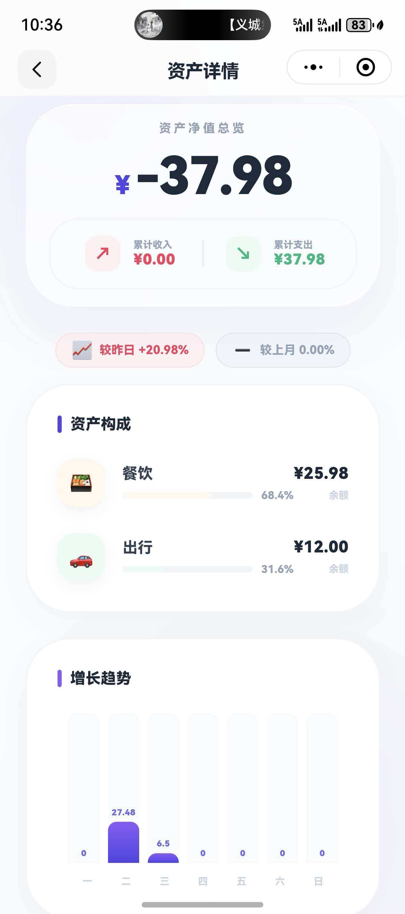

## 功能介绍

本小程序用于日常收支记录与基础财务管理，围绕「快速记账」和「清晰查看」两个核心目标进行设计，整体功能保持轻量，同时预留了后续功能扩展空间。

### 已实现功能

- **收支记账**
  - 支持收入 / 支出类型记录
  - 支持分类、金额与备注信息
  - 默认使用当前日期，减少重复操作

- **账单列表**
  - 按日期对账单进行分组展示
  - 支持按月份切换查看历史账单
  - 列表结构清晰，便于快速回顾与核对

- **数据统计**
  - 提供月度收入 / 支出汇总
  - 支持按分类统计消费数据
  - 用于快速了解个人消费结构

- **数据存储**
  - 使用本地缓存保证基础使用体验
  - 数据结构设计支持后续云端同步扩展

### 设计特点

- 以真实使用场景为出发点，避免功能堆叠
- 数据模型清晰，便于后续功能组合与扩展
- 记账流程尽量简化，降低使用成本

### 计划支持（Roadmap）

在现有记账功能稳定的基础上，后续计划逐步支持以下能力：

- **清单（Checklist）**
  - 用于记录待办事项或周期性支出计划
  - 可与记账数据进行关联，形成消费记录闭环

- **日程提醒**
  - 支持重要账单、周期性支出的提醒
  - 减少遗漏固定支出或重要事项

- **功能组合**
  - 记账、清单与日程之间进行数据关联
  - 逐步形成以“记录 + 计划 + 提醒”为核心的个人管理工具

> 上述功能将根据实际使用反馈逐步实现，优先保证稳定性与可维护性。
>
> 
| 功能模块 | 页面示意 |
|----------|----------|
| 快速记账 |   |
| 月度统计 |   |
| 收支流水 |   |
| 收支流水 |   |
| 空间列表 |   |
| 记一笔   |   |

