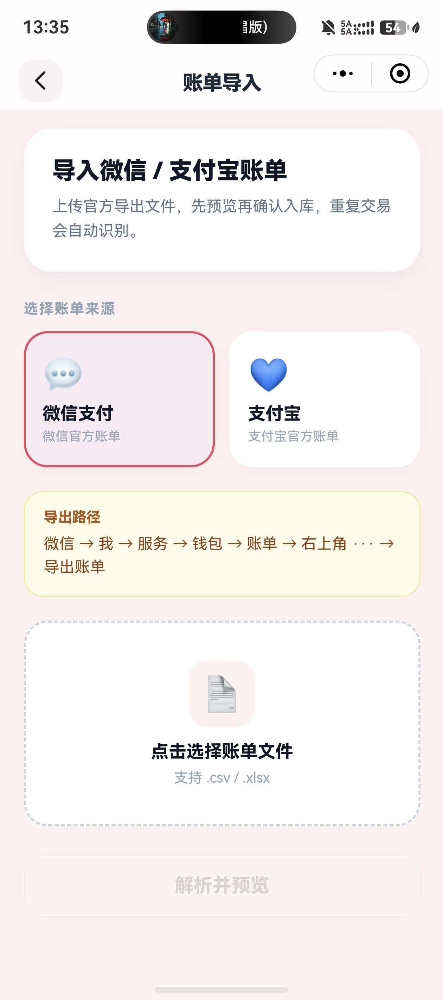
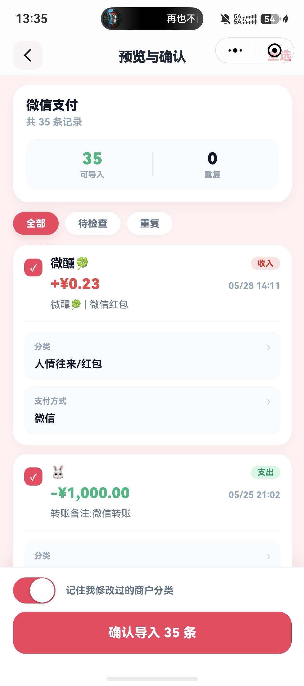
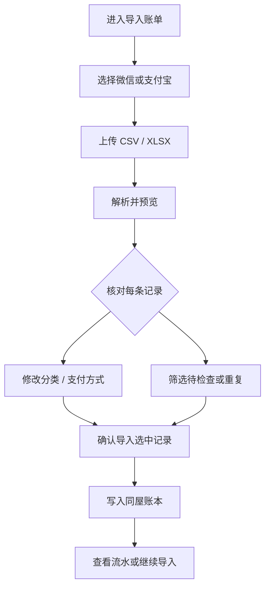

# 账单导入功能 · 使用说明

> 更新周期：2026 年 6 月  
> 适用版本：Roomie 小程序 v2.1  
> 面向读者：同屋成员 / 普通用户

---

## 这个功能能做什么？

把 **微信支付** 或 **支付宝** 官方导出的账单文件（`.csv` / `.xlsx`）导入到 Roomie 同屋账本里，不用逐条手动记账。

导入过程是 **先预览、再确认**：

- 重复的交易会自动识别，不会重复入账
- 导入前可以修改分类、支付方式
- 改过的商户分类可以记住，下次自动匹配

---

## 从哪里进入？

1. 打开同屋 **首页**，进入 **账本** 区域  
2. 点击 **全部流水**（或账本卡片上的导入入口）  
3. 选择 **导入账单**

---

## 使用步骤

### 第一步：选择来源并上传文件

1. 选择账单来源：**微信支付** 或 **支付宝**
2. 按页面上的 **导出路径** 指引，在手机里导出官方账单
3. 点击 **选择账单文件**，选中导出的 `.csv` 或 `.xlsx`
4. 点击 **解析并预览**

**微信账单导出路径：**

> 微信 → 我 → 服务 → 钱包 → 账单 → 右上角 ··· → 导出账单

**支付宝账单导出路径：**

> 支付宝 → 我的 → 账单 → 右上角 ··· → 导出

---

### 第二步：预览并确认

解析完成后，会进入 **预览与确认** 页面：

| 区域 | 说明 |
|------|------|
| 顶部统计 | 显示总条数、**可导入**、**重复**、**待检查** 数量 |
| 筛选标签 | **全部** / **待检查** / **重复** |
| 每条记录 | 可勾选、查看金额与时间、修改 **分类** 和 **支付方式** |
| 右上角 | **全选** 可快速选中所有可导入项 |
| 底部 | 勾选「记住我修改过的商户分类」后，点击 **确认导入** |

**常见状态说明：**

| 状态 | 含义 |
|------|------|
| 可导入 | 新记录，勾选后会写入账本 |
| 重复 | 之前已导入过，无法再次勾选 |
| 待检查 | 分类不太确定，建议核对后再导入 |

如果某条记录的分类不对，点 **分类** 修改；改完后，同商户的其他记录可 **批量应用** 相同分类。

---

### 第三步：查看结果

导入完成后会显示：

- **成功**：写入账本的条数  
- **重复**：跳过的重复条数  
- **跳过 / 失败**：未导入或出错的条数  

可选择 **查看流水** 回到账本，或 **继续导入** 上传下一份账单。

---

## 功能流程图

---

## 使用小贴士

1. **请用官方导出文件**，不要用第三方整理过的表格，以免解析失败。  
2. **重复记录不会重复入账**，可以放心多次导入同一份账单做核对。  
3. 有 **待检查** 标记时，建议先看分类再导入。  
4. 开启 **记住商户分类** 后，同一商户下次导入会更省事。  
5. 导入的是 **当前同屋、当前账本** 的流水，请确认已进入正确的空间。

---

## 目前已实现的效果

| 能力 | 是否支持 |
|------|----------|
| 微信支付账单 | ✅ |
| 支付宝账单 | ✅ |
| CSV / XLSX 文件 | ✅ |
| 导入前预览 | ✅ |
| 重复交易识别 | ✅ |
| 修改分类 | ✅ |
| 修改支付方式 | ✅ |
| 待检查提示 | ✅ |
| 同商户批量改分类 | ✅ |
| 记住商户分类规则 | ✅ |
| 导入结果统计 | ✅ |

---

## 常见问题

**Q：解析失败怎么办？**  
A：确认文件来自微信 / 支付宝官方导出，且格式为 `.csv` 或 `.xlsx`。

**Q：为什么有些记录不能勾选？**  
A：被标记为 **重复** 的记录已经导入过，系统会自动跳过。

**Q：导入后在哪里看？**  
A：在同屋 **账本 → 全部流水** 中查看，与手动记账的记录在一起。

**Q：可以只导入部分记录吗？**  
A：可以。预览页取消勾选不需要的记录，只导入选中的条目。
